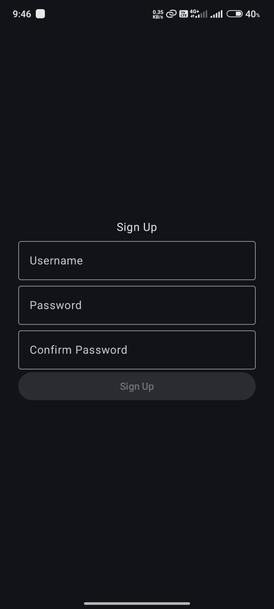
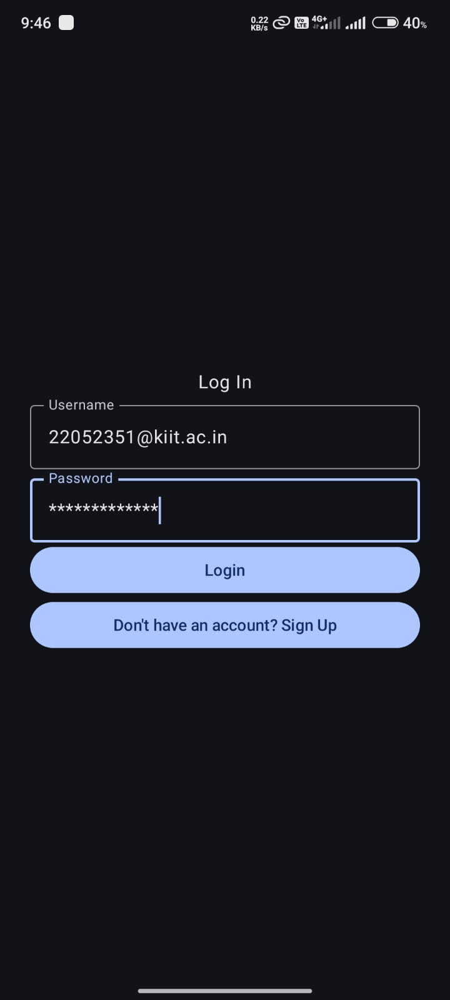
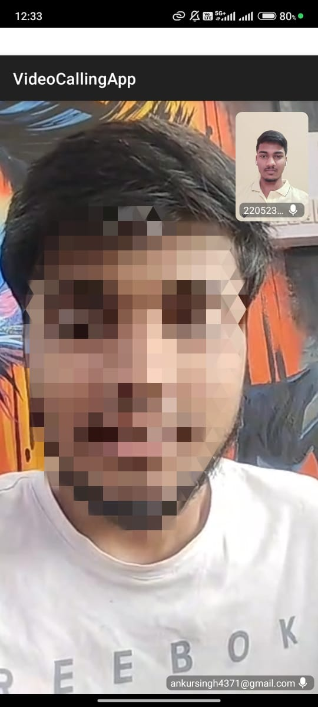

# 📱 VideoCalling App

> Real-time 1:1 video/audio calling Android app built with **Jetpack Compose**, **ZegoCloud API**, **Firebase**, and **Dagger Hilt** in **Kotlin** using Android Studio.

---

## ✨ Features
- 🎥 Real-Time Video and Audio Calling using ZEGOCLOUD SDK
- 🎨 100% Kotlin and Jetpack Compose based Implementation
- 🔒 Secure User Authentication via Firebase
- 🛡️ Secure and efficient API communication
- 📦 Clean MVVM architecture with Hilt Dependency Injection

---

## 🛠️ Tech Stack
| Tech | Usage |
|:---|:---|
| Kotlin | App development |
| Jetpack Compose | UI toolkit |
| Dagger Hilt | Dependency injection |
| ZegoCloud SDK | Video call backend |
| Firebase | Authentication |
| Android Studio | IDE |

---

## 📸 Screenshots

<div style="display: flex; flex-wrap: wrap; justify-content: center; gap: 20px;">

  
  
  

  
  
  
  
  

</div>

---

## 🏗️ Architecture

> Followed **MVVM** architecture with best practices.

---

## 📦 Getting Started

Follow these steps to get a local copy up and running:

1. Clone the repository:
   ```bash
   git clone https://github.com/adarshabhishek/VideoCallingApp.git

